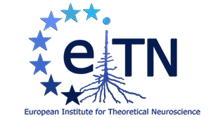

Repository for the tutorial:

## Introduction to brain connectivity

held at the **[EITN Spring School on Computational Neuroscience](https://springschool2020.sciencesconf.org)**, March 4 - 13, 2020. Institut Supérieur Clorivière. 119, boulevard Diderot, 75012 Paris.

**Tutor:**
[Gorka Zamora-López](http://www.zamora-lopez.xyz) (Center for Brain and Cognition, Pompeu Fabra University) 

#### Summary
In this tutorial we will walk through the principles of large-scale connectivity in the brain. The conceptual differences between structural connectivity, functional connectivity and effective connectivity will be elucidated. Finally, the basic tools to study connectivity will be illustrated, which are based on graph theory and complex networks. The tutorial includes both a theoretical part and hands-on exercises.

----------------------

### NOTES:

- Technical requirements for the exercises:
	1. Python 3.6 or 3.7 installed together with typical packages:
		* NumPy.
		* Scipy.
		* Matplotlib.
		* Jupyter notebooks.
		* IPython.
	2. Additionally, the package “*GAlib: A graph analysis library in Python/Numpy*” will be employed for the network analysis. Follow the installation instructions in: [https://github.com/gorkazl/pyGAlib](https://github.com/gorkazl/pyGAlib).
	3. Dataset: structural cortico-cortical connectivity in the cat’s brain. See the 'Data/Cat/' folder in this repository.	 

